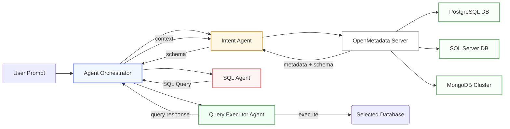
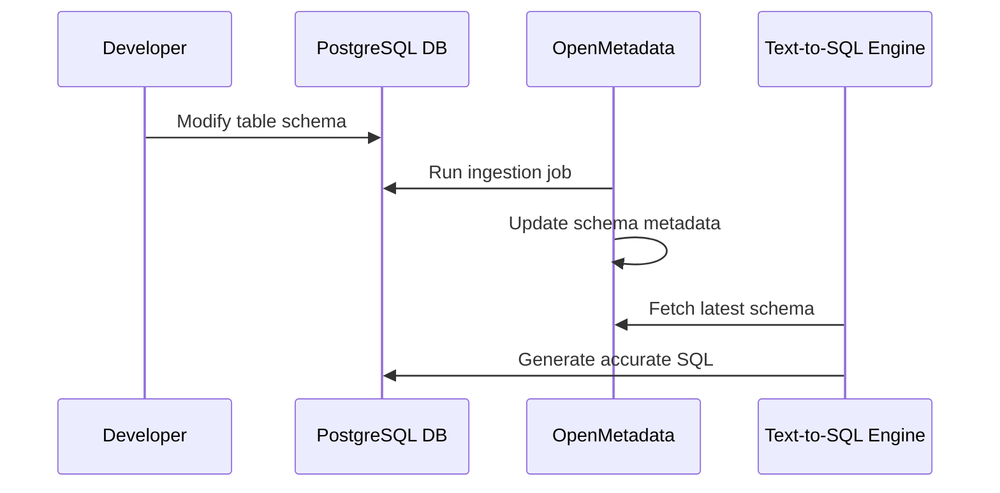

# Leveraging OpenMetadata for LLM-powered Text-to-SQL Tool

---

## 1. Background

The **LLM-powered Text-to-SQL generation tool** should work with **multiple types of databases** - PostgreSQL, SQL Server, MongoDB, etc.

To ensure accurate SQL generation, the LLM needs to understand:
- The structure of each database (tables, columns, relationships)
- Data lineage and ownership
- Schema changes over time

This **metadata** is often distributed and manually updating is prone to inconsistencies.

---

## 2. What is OpenMetadata

**OpenMetadata** is an **open-source metadata and data governance platform** that connects to multiple data systems and builds a **central catalog** of metadata.

It provides:
- Unified metadata ingestion from all databases
- Versioning, lineage and schema tracking
- APIs and SDKs to access metadata for integration with LLMs
- Data governance, tagging and ownership information
- UI dashboard for visualization

OpenMetadata is **open source** (Apache 2.0 licensed) and deployable **on-prem** or **cloud**.

### Architecture Snapshot

It runs in Docker or Kubernetes and usually consists of:
- **Metadata Server** (central REST APIs and metadata store)
- **Ingestion Framework** (to collect metadata via connectors)
- **UI** (data catalog web interface)
- **Elasticsearch** (for search)
- **PostgreSQL/MySQL** (for metadata persistence)
- **OpenMetadata Python SDK** (for automation and integration)

The system is horizontally scalable and can be integrated into CI/CD for automatic metadata updates.

### Typical Use Case Example

Let's say a company has:
- Data in Snowflake
- Pipelines in Airflow
- Models in MLFlow
- Dashboards in Power BI

OpenMetadata can connect to all of these and gives a single dashboard showing:
- Where a data point originated
- Which pipeline transformed it
- Which dashboard consumes it
- Who owns and approved it
- Whether it contains PII

---

## 3. Why We Need It

| Challenge | Impact | Solution via OpenMetadata |
|------------|---------|---------------------------|
| Multiple database types (SQL, NoSQL) | Fragmented schema info | Unified metadata ingestion |
| Schema updates or drift | LLM may use outdated structure | Auto-ingestion sync and versioning |
| Manual metadata tracking | Inefficient and error-prone | Automated discovery connectors |
| Limited schema context for LLM | Inaccurate SQL generation | LLM fetches real-time schema via API |

---

## 4. Conceptual Architecture



**Explanation:**  
- Let's say user asks - _“Show me top 5 customers by revenue this quarter.”_
- **Intent Agent** interprets this is a data retrieval task. It queries the OpenMetadata Server to retrieve schema and table information relevant to that intent.
- **OpenMetadata Server** provides metadata - column names, types, relationships and lineage instead of querying data directly.
- **SQL Agent** is powered by an LLM model fine-tuned or prompted for schema-aware SQL generation.
- **Query Executor Agent** executes it on the Selected Database (PostgreSQL, SQL Server or MongoDB).

---

## 5. Setup Overview

### Components
- **OpenMetadata Server:** central orchestration service (runs via Docker or Kubernetes)
- **Metadata DB:** internal store (e.g. MySQL or PostgreSQL)
- **Ingestion Pipelines:** connectors to external databases
- **UI & API Access:** web console + REST + Python SDK

### Deployment Steps
1. Clone the OpenMetadata repo or use Docker Compose image
2. Configure connections for each data source (PostgreSQL, MongoDB, etc.)
3. Run metadata ingestion pipelines
4. Access the OpenMetadata UI to verify data catalog
5. Connect LLM via REST API or SDK to fetch schema information

---

## 6. Future Maintenance and Updates

When a database schema changes (e.g. columns added/removed in the external DB):
- Update ingestion configuration (optional; many auto-detect)
- Re-run the ingestion pipeline
- Metadata automatically updates in OpenMetadata
- LLM references new metadata from the catalog for SQL generation



---

## 7. How LLM Queries OpenMetadata (Example)

Below shows a simplified way to fetch schema metadata via REST API before generating SQL.

### REST API Example

```bash
curl -X GET "http://<openmetadata-host>:8585/api/v1/tables?database=FinanceDB"      -H "Authorization: Bearer <access_token>"
```

### Sample JSON Response

```json
{
  "tables": [
    {
      "name": "transactions",
      "columns": [
        {"name": "transaction_id", "dataType": "STRING"},
        {"name": "amount", "dataType": "FLOAT"},
        {"name": "currency", "dataType": "STRING"}
      ]
    }
  ]
}
```

### Python Pseudocode

```python
import requests

def get_schema(database_name):
    url = f"http://openmetadata-server:8585/api/v1/tables?database={database_name}"
    headers = {"Authorization": f"Bearer {ACCESS_TOKEN}"}
    response = requests.get(url, headers=headers)
    return response.json()

schema = get_schema("FinanceDB")
print(schema)
```

The LLM can use this metadata dynamically to construct accurate SQL queries across any connected database.

---

## 8. Benefits Recap

- Central metadata source for all databases
- Auto-syncs with schema changes
- Enables LLM context-awareness for SQL generation
- Simplifies governance, lineage and data discovery
- Reduces manual documentation effort

---

## 9. Next Steps

1. Prototype a minimal OpenMetadata setup using Docker
2. Connect PostgreSQL and MongoDB test instances
3. Integrate LLM with OpenMetadata API
4. Measure accuracy improvements in generated SQL
5. Extend to production databases after validation
6. Integrate governance and data classification (PII/masking/risk scoring) from OpenMetadata to make your text-to-SQL model safer.

---

## 10. References

- [OpenMetadata Documentation](https://open-metadata.org/docs)
- [GitHub: open-metadata/OpenMetadata](https://github.com/open-metadata/OpenMetadata)
- [OpenMetadata API Reference](https://open-metadata.org/docs/api)
